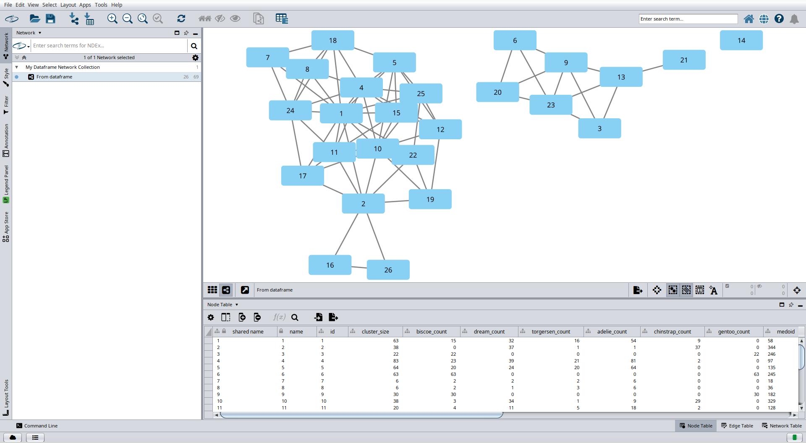
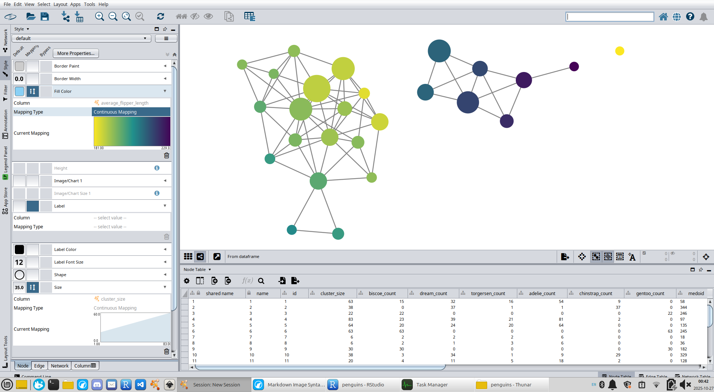
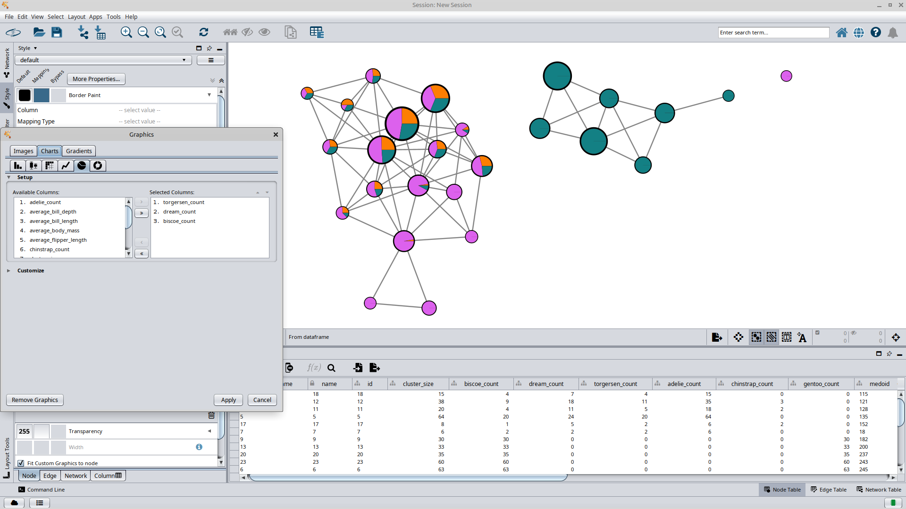
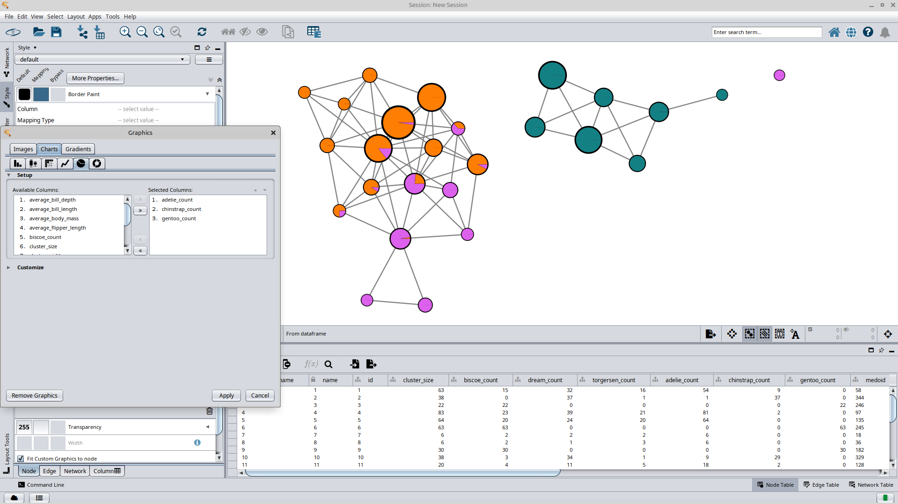

```{r}
knitr::opts_chunk$set(fig.pos = "H", out.extra = "")

if (!require(mappeR)) {
  install.packages("mappeR")
}

if (!require(RCy3)) {
  install.packages("RCy3")
}

library(mappeR)
library(RCy3)
```

In this vignette we will explore the `penguins` data set with `mappeR`. The data set contains measurements and characteristics of 344 penguins from three islands in the Palmer Archipelago, Antarctica. It is available natively in R.


```{r}
head(penguins)
```

For simplicity, we will omit any rows with missing values from our data.

```{r}
clean_penguins = na.omit(penguins)
clean_penguins$id = 1:nrow(clean_penguins)
```

To use `mappeR`, we need to build a *distance matrix* for our penguins. One way to do this is to treat each penguin as a vector in $\mathbb{R}^4$, with coordinates given by bill length, bill depth, flipper length, and body mass. As each are given in different units, we will first scale each column via $$col \mapsto \frac{col - \min(col)}{\max(col) - \min(col)}$$ This is called *min-max feature scaling*.

```{r}
# get numerical columns only
penguin_numbers = subset(clean_penguins,
                         select = c(bill_len, bill_dep, flipper_len, body_mass))

# perform min-max normalization
normal_penguin_numbers = apply(penguin_numbers, 2, function(column)
  (column - min(column)) / (max(column) - min(column)))

# calculate euclidean distances
penguin_dists = dist(normal_penguin_numbers)
```

Now we'll use Ball Mapper to visualize "penguin space." The program creates a graph from our penguins by constructing the $1$-dimensional nerve of a cover $\varepsilon$-balls. In other words, this graph's vertices will represent balls of penguins $\varepsilon$ in radius, and its edges connect balls with penguins in common. We'll arbitrarily choose a value of $\varepsilon = 0.25$, and also calculate relevant statistics about each of the clusters of penguins, such as average flipper length and species counts.

```{r}
# generate ball mapper object
penguin_ball_mapper = create_ball_mapper_object(clean_penguins, penguin_dists, .25)

# get the data from each vertex in the ball mapper graph
penguin_balls = lapply(penguin_ball_mapper[[1]]$data, function(x)
  clean_penguins[unlist(strsplit(x, ", ")), ])

# calculate mean statistics for penguins in each vertex
penguin_ball_mapper[[1]]$average_bill_length = sapply(penguin_balls, function(penguin_ball)
  mean(clean_penguins[penguin_ball$id, "bill_len"]))
penguin_ball_mapper[[1]]$average_bill_depth = sapply(penguin_balls, function(penguin_ball)
  mean(clean_penguins[penguin_ball$id, "bill_dep"]))
penguin_ball_mapper[[1]]$average_flipper_length = sapply(penguin_balls, function(penguin_ball)
  mean(clean_penguins[penguin_ball$id, "flipper_len"]))
penguin_ball_mapper[[1]]$average_body_mass = sapply(penguin_balls, function(penguin_ball)
  mean(clean_penguins[penguin_ball$id, "body_mass"]))

# count islands in each vertex
penguin_ball_mapper[[1]]$biscoe_count = sapply(penguin_balls, function(penguin_ball)
  sum(clean_penguins[penguin_ball$id, "island"] == "Biscoe", na.rm = TRUE))
penguin_ball_mapper[[1]]$dream_count = sapply(penguin_balls, function(penguin_ball)
  sum(clean_penguins[penguin_ball$id, "island"] == "Dream", na.rm = TRUE))
penguin_ball_mapper[[1]]$torgersen_count = sapply(penguin_balls, function(penguin_ball)
  sum(clean_penguins[penguin_ball$id, "island"] == "Torgersen", na.rm = TRUE))

# count species in each vertex
penguin_ball_mapper[[1]]$adelie_count = sapply(penguin_balls, function(penguin_ball)
  sum(clean_penguins[penguin_ball$id, "species"] == "Adelie", na.rm = TRUE))
penguin_ball_mapper[[1]]$chinstrap_count = sapply(penguin_balls, function(penguin_ball)
  sum(clean_penguins[penguin_ball$id, "species"] == "Chinstrap", na.rm = TRUE))
penguin_ball_mapper[[1]]$gentoo_count = sapply(penguin_balls, function(penguin_ball)
  sum(clean_penguins[penguin_ball$id, "species"] == "Gentoo", na.rm = TRUE))
```

Finally, we'll use `RCy3` to send the data over to Cytoscape, where we can manipulate style parameters with its GUI.

```{r}
# This line requires a running instance of Cytoscape to run
# createNetworkFromDataFrames(penguin_ball_mapper[[1]], penguin_ball_mapper[[2]])
```



We see a graph with three connected components, but not much else. We'll use the styling abilities of Cytoscape to inject information back into the graph.



Over in the style tab, we've changed the node shape to ellipse, locked node width and height, and set node size to a continuous function of the number of penguins per node (the `cluster size` value of the nodes data frame outputted by `mappeR`). The node fill coloring is based on average flipper length. From these, we note that the graph's singleton node contains only one penguin, and the penguins with the longest flippers seem to live in the same connected component.

 Here is one way to compare two variables at once. We have kept the flipper length node fill coloring as before, but now we have augmented the graph with node border colors. Nodes with lighter borders contain penguins with shorter bill lengths, and darker nodes contain penguins with longer bill lengths. We can see that longer bill lengths belong to all connected components of the graph, with the singleton node representing a penguin with quite a large one!



Here we have used some custom graphics to make pie charts showing island membership per node. Torgersen Island is orange, Dream Island is purple, and Biscoe Island is teal. We can see that Torgersen Island appears to be the most diverse; penguins living there are similar to ones living on the other two islands. The opposite is true for Biscoe Island, whose members are generally more similar to each other than those living on the other islands --- an entire connected component is composed of only Biscoe natives!



We can do a similar pie chart analysis of the species of our penguins in the Ball Mapper graph. Here, Adelie penguins are orange, Chinstrap penguins are purple, and Gentoo penguins are teal. Most of the nodes are composed of just one species of penguin, with one connected component --- made up of penguins on Biscoe Island --- entirely composed of Gentoo penguins. There *do* exist nodes in the other connect component with both Adelie and Chinstrap penguins, suggesting there are members of those species that are similar to each other. Representatives from these nodes can be found in the original data set through the `medoid` column, which contains the labels of the data points in each node with a minimum sum of distances to every other data point.
